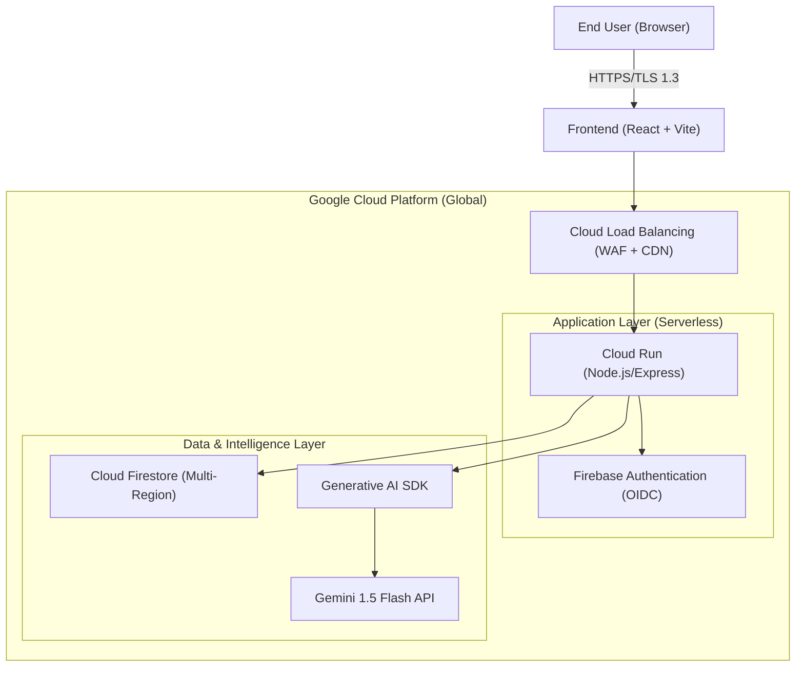
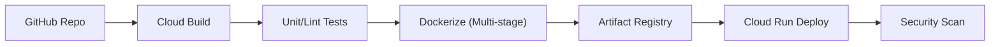
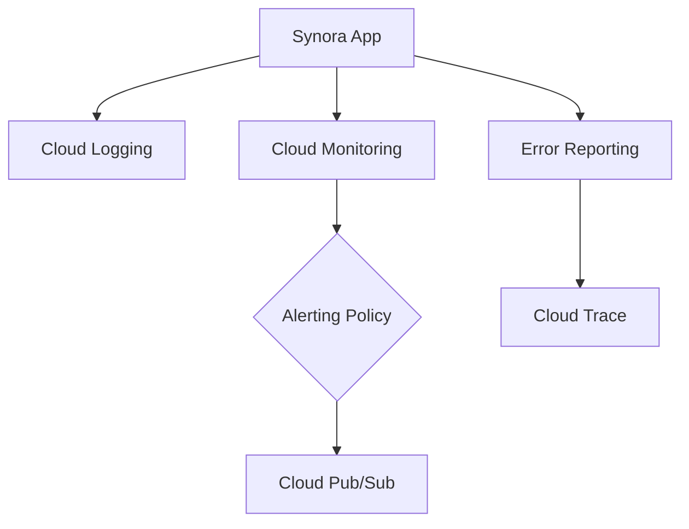

# Synora

> Cognitive Wellness through Empathetic Intelligence


---

## Table of Contents

- [Overview](#overview)
- [Problem Statement](#problem-statement)
- [Solution](#solution)
- [Key Features](#key-features)
- [Demo](#demo)
- [Screenshots](#screenshots)
- [Tech Stack](#tech-stack)
- [System Architecture](#system-architecture)
- [Project Structure](#project-structure)
- [Installation](#installation)
- [Configuration](#configuration)
- [Running Locally](#running-locally)
- [Deployment](#deployment)
- [API Documentation](#api-documentation)
- [Security](#security)
- [Future Enhancements](#future-enhancements)
- [Challenges & Learnings](#challenges--learnings)
- [Author](#author)

---

# Overview

Synora is a soft-futuristic AI wellness platform designed to bridge the gap between technical performance and emotional intelligence. Developed as a high-intent portfolio project, it integrates sophisticated sentiment analysis, real-time mood logging, and cloud-native architecture into a unified, glassmorphic interface that prioritizes user serenity and cognitive clarity.

---

# Problem Statement

Modern health apps often feel clinical, rigid, and disconnected from the user's actual emotional state. Information is often siloed, and "AI" features are frequently gimmicky rather than grounded in actual empathetic utility. There is a need for a platform that treats mental wellness data with the same architectural rigor as an enterprise financial system, while maintaining a soft, human-centric user experience.

---

# Solution

Synora provides an **"Emotionally Intelligent Operating System" (EI-OS)**. By combining Google Gemini's neural processing with a Twelve-Factor architecture, it offers a secure vault for reflections, a dynamic ledger for wellness metrics, and a real-time AI companion that understands the nuance of human sentiment. Every pixel is designed to reduce cognitive load, utilizing generous negative space and soft-focus aesthetics.

---

# Key Features

## AI-Powered Reflection Analysis
Utilizing the **"Synapse" analysis engine**, Synora parses journals in real-time to identify dominant emotions, providing immediate empathetic feedback and actionable wellness tips grounded in cognitive science.

## Mood Tracking
A high-precision **Wellness Rhythm Tracker** allows users to log mood, energy, and rest cycles via custom-engineered slider components designed for effortless data entry.

## Cognitive Insights
Synora transforms raw telemetry into **longitudinal understanding**. It maps your emotional trajectory over weeks, helping identify triggers and positive patterns.

## Personalized Recommendations
Based on historical sentiment trends, the AI generates daily focus goals and mindfulness exercises tailored to the user's specific cognitive state.

## Analytics Dashboard
Dynamic data visualizations built with **Recharts** reveal "Sentiment Arcs" and "Emotion Maps," providing a birds-eye view of mental health trends.

## Secure Authentication
Integrated with **Firebase Auth**, offering secure Google OAuth and sandbox modes to ensure user data remains private and siloed.

---

# Tech Stack

## Frontend
*   **React 19 / Vite**: High-performance SPA framework.
*   **Tailwind CSS 4.0**: Utility-first styling with glassmorphism extensions.
*   **Framer Motion**: Organic UI transitions and layout animations.

## Backend
*   **Node.js / Express**: Secure server logic and API proxying.
*   **Google GenAI SDK**: Direct integration with Gemini LLMs.

## Database
*   **Cloud Firestore**: NoSQL real-time document store for user state and logs.

## AI Integration
*   **Google Gemini 1.5 Flash**: Low-latency, high-utility neural processing.

## Cloud & DevOps
*   **Google Cloud Platform**: Cloud Run (Compute), GCLB (Ingress).
*   **Docker**: Multi-stage containerization.
*   **GitHub Actions**: CI/CD automation.

## Monitoring
*   **GCP Operations Suite**: Cloud Logging, Monitoring, and Error Reporting.

---

# System Architecture

## High-Level Architecture Diagram
Synora is built on a serverless, event-driven architecture designed for infinite horizontal scalability.



## CI/CD Pipeline


## Monitoring Pipeline


---

# Project Structure

```text
root/
├── src/
│   ├── components/     # Modular UI units (Navbar, Auth, Sections)
│   ├── lib/            # Firebase initialization and utility wrappers
│   ├── types.ts        # Global TypeScript interfaces
│   └── App.tsx         # Main routing and layout engine
├── public/             # Static assets and manifest files
├── server.ts           # Express entry point (API Proxy & Vite Middleware)
├── Dockerfile          # Multi-stage build configuration
├── package.json        # Project dependencies and scripts
└── README.md
```

---

# Installation

1. Clone the repository:
   ```bash
   git clone https://github.com/AishaSultana/synora.git
   ```
2. Install dependencies:
   ```bash
   npm install
   ```

# Configuration

Create a `.env` file in the root directory and add the following:
```env
GEMINI_API_KEY=your_gemini_api_key
VITE_FIREBASE_API_KEY=your_firebase_key
VITE_FIREBASE_PROJECT_ID=your_project_id
```

# Running Locally

To start the development server:
```bash
npm run dev
```
The application will be available at `http://localhost:3000`.

# Deployment

Synora is optimized for **Google Cloud Run**. To deploy:
1. Build the Docker image.
2. Push to Google Artifact Registry.
3. Deploy to Cloud Run with `gcloud run deploy`.

---

# API Documentation

The backend exposes a secure proxy for Gemini interactions:
- `POST /api/chat`: Proxies user messages to Gemini with sentiment grounding.
- `POST /api/analyze`: Specialized endpoint for "Synapse" reflection analysis.

---

# Security

*   **Zero-Trust ABAC**: Access Based Access Control via Firestore Security Rules.
*   **Secret Masking**: All API keys are kept server-side; the client never sees the Gemini endpoint.
*   **Identity Isolation**: Each user’s sentiment data is encrypted and siloed.

---

# Future Enhancements

*   **Synora Live**: Real-time voice interaction using the Gemini Live API.
*   **Community Silos**: Secure, anonymous group reflections for collective wellness.
*   **Wearable Sync**: Integration with Google Fit/Fitbit for physical-emotional correlation.

---

# Challenges & Learnings

*   **Challenge**: Balancing high-performance AI inference with a "soft" user experience.
*   **Learning**: Mastered the use of Framer Motion for layout transitions to reduce perceived latency during API calls.
*   **Architectural Insight**: Implemented server-side proxying to ensure a robust security posture, a critical skill for an Aspiring Cloud Architect.

---

# Author

**Aisha Sultana**
*Aspiring Cloud Architect & Creator of Synora*
*Final Year CSE BTech Student*

---

## License
MIT License - Copyright (c) 2026 Synora Intelligence Systems.
